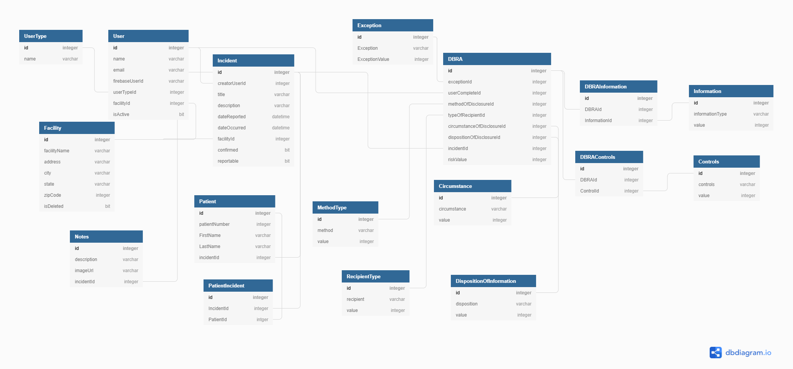

# Pry-Vata

A healthcare privacy allegation tracking mechanism providing CRUD functionality for its users. What sets this application apart from other B2B SaaS healthcare privacy product is that it incorporates a data breach risk assessment, which allows the user to determine if the confirmed allegation is high risk, low risk, or meets an exception. Depending on the risk determined, the investigator may be required to report it to their respective state's Health and Human Services Agency and/or the Office of Civil Rights. This application can allow almost anyone, with basic knowledge of HIPAA, to review and determine the risk of their incident. 

### Data Breach Risk Assessment Reference: 
[Blake Bundham Handout](https://assets.hcca-info.org/Portals/0/PDFs/Resources/Conference_Handouts/Regional_Conference/2016/Orlando/BlakeBudmanhandout.pdf)
 
[NCHICA HITECH Act Breach Notification Risk Assessment Tool](https://assets.hcca-info.org/Portals/0/PDFs/Resources/Conference_Handouts/Compliance_Institute/2010/410handout2.pdf)

### Built With 
* ReactJS
* CSS
* HTML
* Adobe Photoshop
* C#
* .Net
* SqlServer
* Firebase

## Getting Started

To get a local copy up and running follow these simple steps.

## Requirements

* VSCode
* Visual Studios
* SqlServer
* Git
* NodeJS

## Installation 

* Clone the repository 

    `git clone git@github.com:sxiong0519/PryVata.git`

* In order to create authenticated accounts, create a Firebase account and project
-See directions [here](https://github.com/nashville-software-school/bangazon-inc/blob/main/book-3-web-api/chapters/FIREBASE_AUTH.md) to create a Firebase project and users.

* Once you've created your Firebase project:

    1. Create a sub-file under the appsettings.json file and name it `appsettings.Development.json`
    2. Add the code below to the new file and update the "FIREBASE_PROJECT_ID_HERE" key to the value of your Firebase project id.

        `{
        "FirebaseProjectId": "FIREBASE_PROJECT_ID_HERE"
        }`

    3. Create an env.local file in Visual Studio Code with your Firebase API Key

        `REACT_APP_API_KEY=FIREBASE_API_KEY `

* Run the Sql queries in the SqlQuery folder (01_PryVata_Create_DB.sql, then 02_PryVata_Seed_Data.sql)

    1. Make sure to replace users information to reflect your Firebase accounts in the Seed Data

* Execute the PryVata API in Visual Studios

* Install NodeJs and Firebase in your terminal in the `client` folder

    `npm install react-router-dom firebase`

* Run the front end code in Visual Studio Code by going to the client folder

    `npm start`

## Design and Development

### DbDiagram.io - [Entity Relationship Diagram] (https://dbdiagram.io/d/616504a1940c4c4eec90304a)

## Special Thanks

* NSS Instructors: Joe Shephard, Josh Barton, Christina Ashworth, and Bryan Ford
* Indoor Kids: [Michael Trevino](https://github.com/mtrevin93)
* Solitaire card game - my go-to daily activity to decompress after a stressful but successful day of coding
